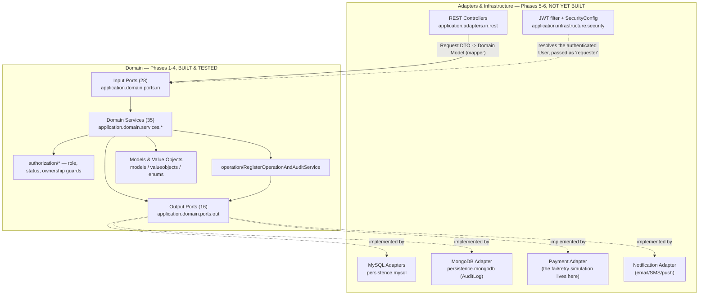
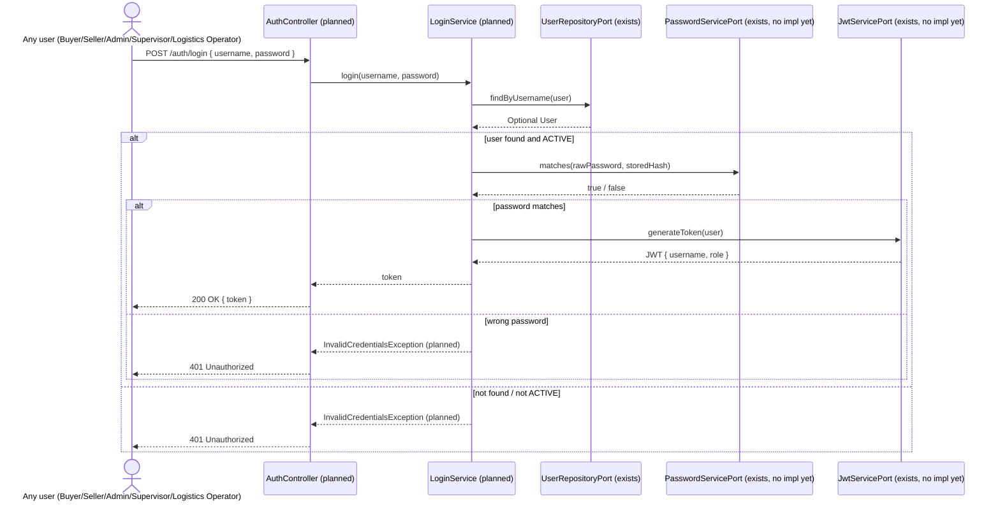
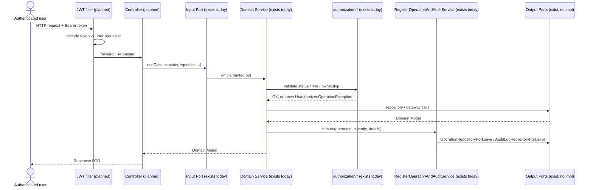
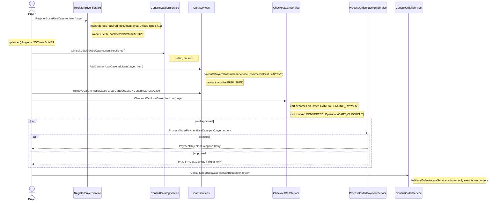
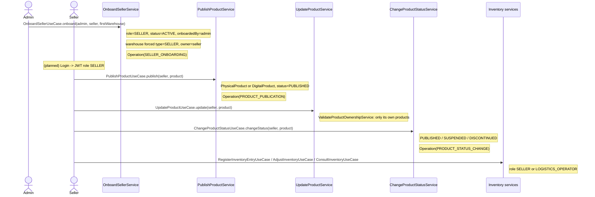
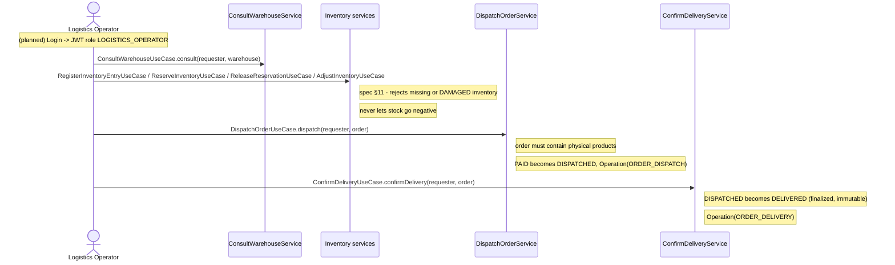
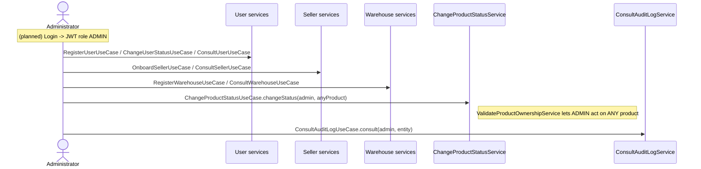
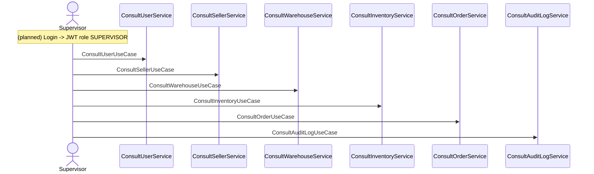
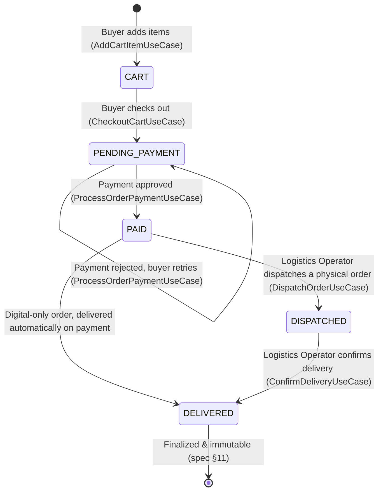

# Code Walkthrough & Role Flows

## 1. Purpose and Scope

This document explains **how the current codebase actually works**, end to end, and
traces **what each role does in the system**, starting from authentication. It
complements the per-subdomain SDD files (which specify *contracts and rules*) with a
narrative walkthrough of *how the pieces call each other* and *what a user's journey
looks like*.

Read this together with:

- [`SDD/Software Architecture/Software Architecture.md`](Software%20Architecture/Software%20Architecture.md) — layer rules.
- [`SDD/domain/Domain Model.md`](domain/Domain%20Model.md) — entities and relationships.
- [`SDD/domain/services/`](domain/services/) — per-subdomain service specs.
- [`ALIGNMENT_PLAN.md`](../ALIGNMENT_PLAN.md) — the phased plan this codebase follows.

---

## 2. What Exists Today vs. What's Planned

**Important:** nothing in this repository runs end to end yet, and **there is no
login**. Phases 1–4 (domain modeling, services, ports) are complete; phases 5–7
(persistence, REST, security, schedulers) are not started.

| Layer | Status | Where |
| ----- | ------ | ----- |
| Domain models, Value Objects, exceptions | ✅ Built | `application.domain.{models,valueobjects,enums,exceptions}` |
| Domain services (business logic) | ✅ Built, unit-tested | `application.domain.services.*` (35 classes) |
| Input Ports (use-case contracts) | ✅ Built | `application.domain.ports.in` (28 interfaces) |
| Output Ports (contracts to the outside) | ✅ Built, **zero implementations** | `application.domain.ports.out` (16 interfaces) |
| Persistence adapters (MySQL / MongoDB) | ❌ Not built | Phase 5 |
| `PaymentGatewayPort` adapter (payment simulation) | ❌ Not built | Phase 5 |
| `NotificationPort` adapter (e-mail/SMS/push) | ❌ Not built | Phase 5 |
| `PasswordServicePort` / `JwtServicePort` adapters | ❌ Not built | Phase 6 |
| **Login / authentication (`LoginService`, `SecurityConfig`, JWT filter)** | ❌ **Not built at all** | Phase 6 |
| REST controllers | ❌ Not built | Phase 6 |
| Schedulers, data seeder | ❌ Not built | Phase 7 |

Because there is no persistence and no security, **you cannot currently run
`./mvnw spring-boot:run` and use the API**. What you *can* do is run
`./mvnw test`: every domain service is unit-testable in isolation by constructing it
directly with hand-written fake ports (see `application.domain.support.Fakes` and the
three test classes under `src/test/java/application/domain/`).

Every flow described below for phases 5–7 is therefore the **intended design**, traced
from the ports and services that already exist — not something you can click through
today.

---

## 3. High-Level Architecture



Dependencies always point **toward the domain**. Nothing in `application.domain.*`
imports Spring Web, JPA, MongoDB or a JWT library — the only Spring dependency is the
`@Service` stereotype used for wiring.

---

## 4. Building Blocks Recap

A one-paragraph refresher per package (full detail in the linked SDD files):

- **`models/`** — `Person → User / Buyer / Seller`, `Product → PhysicalProduct /
  DigitalProduct`, plus `Category`, `ProductVariant`, `Warehouse`, `InventoryItem`,
  `InventoryMovement`, `Cart`/`CartItem`, `Order`/`OrderItem`, `Operation`, `AuditLog`,
  `Notification`. Relationships are object references, never IDs. See
  [Domain Model](domain/Domain%20Model.md).
- **`valueobjects/`** — `DomainCatalog` (code/name/description, equality by code) and
  its 12 catalogs (`UserRole`, `OrderStatus`, `InventoryItemCondition`, …), plus
  `Money`/`Email`/`DocumentId`/`StockQuantity` as validating `record`s. See
  [Domain Value Objects](domain/Domain%20Value%20Objects.md).
- **`exceptions/`** — `DomainException` (base) and 8 specific subtypes
  (`UnauthorizedOperationException`, `NegativeStockException`,
  `InvalidReservationException`, `FinalizedOrderModificationException`, …).
- **`services/<subdomain>/`** — one class per use case, `@Service` +
  `@RequiredArgsConstructor`, implementing the matching Input Port. See
  [Domain Services](domain/Domain%20Services.md) and the 10 files in
  [`domain/services/`](domain/services/).
- **`ports/in`** — 28 use-case interfaces (`RegisterUserUseCase`,
  `CheckoutCartUseCase`, …). See [Input Ports](domain/Input%20Ports.md).
- **`ports/out`** — 16 interfaces the domain needs from the outside (repositories,
  `PaymentGatewayPort`, `NotificationPort`, `PasswordServicePort`, `JwtServicePort`,
  `BusinessConfigurationPort`). See [Output Ports](domain/Output%20Ports.md).

---

## 5. Authentication Today vs. the Planned Login (Phase 6)

### Why there is no `LoginService`

Authentication is an **infrastructure concern** (spec explicitly excludes
"mecanismos de autenticación técnica" from scope), so it was placed in Phase 6 —
after security and REST adapters exist. Today the domain only *assumes* a `User` has
already been authenticated: every command service takes a `User requester` (or
`Buyer buyer`) parameter and immediately validates it:

```java
validateUserStatusService.execute(requester);              // is it ACTIVE? (RG01)
validateRoleAuthorizationService.execute(requester, ...);   // does it have the right role? (§12)
```

Two output ports already exist for this reason, but have **no implementation and no
consumer yet**:

- `PasswordServicePort` — `encrypt(raw)` / `matches(raw, encoded)`.
- `JwtServicePort` — `generateToken(User user)`.

`RegisterUserService` already calls `PasswordServicePort.encrypt(...)` when creating a
user, so a password is hashed at registration time — but nothing today verifies a
password back, because there is no login endpoint.

### The planned login flow (Phase 6 — not implemented)



After login, every subsequent request carries `Authorization: Bearer <token>`. A
planned JWT filter decodes it into a `User` (`username`, `role`) and hands it to the
controller, which passes it as the `requester` argument into the Input Port — exactly
the parameter every service already expects today.



---

## 6. Role-by-Role Flows

Every flow below starts at **"(planned) Login"** because that is where it will start
once Phase 6 exists. The steps after it are **real, implemented, unit-tested**
services you can find under `src/main/java/application/domain/services/`.

### 6.1 Buyer

No prerequisite — a buyer creates its own account.



**Step by step**

1. **Register** — `RegisterBuyerUseCase.register(buyer)` → `RegisterBuyerService`.
   Validates `mainAddress`, checks document/e-mail uniqueness
   (`DuplicateUserException` otherwise), sets `role = BUYER`,
   `commercialStatus = ACTIVE`. No authentication needed — this *creates* the
   identity that will later log in.
2. **(Planned) Login** → obtains a JWT with `role = BUYER`.
3. **Browse the catalog** — `ConsultCatalogUseCase.consultPublished()` →
   `ConsultCatalogService`. Public; no requester, no authorization check.
4. **Add to cart** — `AddCartItemUseCase.addItem(buyer, item)` →
   `AddCartItemService`. Runs `ValidateBuyerCanPurchaseService` (the buyer must be
   commercially `ACTIVE`), requires the product to be `PUBLISHED`, creates the
   `Cart` on first use.
5. **Manage the cart** — `RemoveCartItemUseCase`, `ClearCartUseCase`,
   `ConsultCartUseCase`. Not audited (low-significance, provisional data).
6. **Checkout** — `CheckoutCartUseCase.checkout(buyer)` → `CheckoutCartService`.
   Builds an `Order` from the cart lines, capturing `unitPrice` from each product at
   that moment; `CART → PENDING_PAYMENT`; the cart is marked `CONVERTED`; records
   `Operation(CART_CHECKOUT)`.
7. **Pay** — `ProcessOrderPaymentUseCase.pay(buyer, order)` →
   `ProcessOrderPaymentService`. Calls `PaymentGatewayPort.process(order)` (the
   probabilistic approve/reject simulation will live in the Phase 5 adapter, not in
   this service). On rejection the order stays `PENDING_PAYMENT` and
   `PaymentRejectedException` is thrown so the buyer can retry step 7. On approval:
   `PAID`, and immediately `DELIVERED` if the order has no physical products; a
   confirmation `Notification` is sent through `NotificationPort`.
8. **Track the order** — `ConsultOrderUseCase.consult(requester, order)` →
   `ConsultOrderService`. `ValidateOrderAccessService` guarantees a buyer only ever
   sees its own orders (spec RG03).
9. **Maintain the profile** — `UpdateBuyerUseCase` / `ConsultBuyerUseCase`, guarded
   by `ValidateBuyerOwnershipService` (self only).

A buyer never has a code path into seller, warehouse or inventory use cases — those
Input Ports simply take a different actor type or reject the `BUYER` role outright.

---

### 6.2 Seller

**Prerequisite: a seller cannot self-register.** It must be onboarded by an `ADMIN`
(spec Domain 3).



**Step by step**

1. **Onboarding (performed by an Admin, not the seller)** —
   `OnboardSellerUseCase.onboard(admin, seller, firstWarehouse)` →
   `OnboardSellerService`. Requires an `ADMIN` requester; checks document
   uniqueness; sets `role = SELLER`, `status = ACTIVE`, `onboardedBy = admin`; forces
   the warehouse to `type = SELLER` with `owner = seller`; records
   `Operation(SELLER_ONBOARDING)`.
2. **(Planned) Login** → JWT with `role = SELLER`.
3. **Publish a product** — `PublishProductUseCase.publish(seller, product)` →
   `PublishProductService`. Requires role `SELLER`; the caller decides
   `PhysicalProduct` vs `DigitalProduct`; sets `status = PUBLISHED`.
4. **Update a product** — `UpdateProductUseCase` → `UpdateProductService`, guarded by
   `ValidateProductOwnershipService` (a seller only touches its own products; an
   `ADMIN` may touch any).
5. **Change a product's status** — `ChangeProductStatusUseCase` →
   `ChangeProductStatusService` — same ownership guard.
6. **Manage inventory** (shared responsibility with `LOGISTICS_OPERATOR`, spec §12) —
   `RegisterInventoryEntryUseCase`, `ReserveInventoryUseCase`,
   `ReleaseReservationUseCase`, `AdjustInventoryUseCase`,
   `ConsultInventoryUseCase`.

> **Gap:** `ConsultSellerUseCase` is currently restricted to `ADMIN` /
> `SUPERVISOR` — a seller cannot yet look up its own seller record through an
> existing Input Port, and there is no "list my products" use case (only the public,
> `PUBLISHED`-only `ConsultCatalogUseCase`). Worth adding self-service consult
> use cases when the REST layer is built in Phase 6. See [§8](#8-known-gaps).

---

### 6.3 Logistics Operator

**Prerequisite:** registered as a plain `User` by an `ADMIN` (`RegisterUserUseCase`
with `role = LOGISTICS_OPERATOR`) — there is no separate onboarding flow like the
seller's; a logistics operator is an internal employee.



**Step by step**

1. **(Planned) Login** → JWT with `role = LOGISTICS_OPERATOR`.
2. **Consult warehouses** — `ConsultWarehouseUseCase` (allowed roles: `ADMIN`,
   `SUPERVISOR`, `LOGISTICS_OPERATOR`).
3. **Operate inventory** — the same five inventory use cases a seller uses
   (`RegisterInventoryEntry`, `ReserveInventory`, `ReleaseReservation`,
   `AdjustInventory`, `ConsultInventory`); `ReserveInventoryService` is where the
   spec §11 rules are enforced (`InvalidReservationException` for missing/`DAMAGED`
   inventory, `NegativeStockException` for over-reservation).
4. **Dispatch an order** — `DispatchOrderUseCase.dispatch(requester, order)` →
   `DispatchOrderService`. Only orders containing physical products can be
   dispatched; `PAID → DISPATCHED`; records `Operation(ORDER_DISPATCH)`.
5. **Confirm delivery** — `ConfirmDeliveryUseCase.confirmDelivery(requester, order)`
   → `ConfirmDeliveryService`. `DISPATCHED → DELIVERED`; the order becomes
   finalized and immutable (spec §11); records `Operation(ORDER_DELIVERY)`.
6. **Consult any order** — `ConsultOrderUseCase`; `ValidateOrderAccessService`
   grants `LOGISTICS_OPERATOR` access to every order, not just one buyer's.

---

### 6.4 Administrator

**Prerequisite / bootstrap problem:** `RegisterUserUseCase` itself requires an
`ADMIN` requester — including to create the *first* admin. There is no seed
mechanism yet (the original plan reserves a `DataSeeder` for Phase 7). Until then,
the first `ADMIN` has to be inserted directly, outside any use case. See
[§8](#8-known-gaps).



**Step by step**

1. **(Planned) Login** → JWT with `role = ADMIN`.
2. **User administration** — `RegisterUserUseCase` (any role, including other
   admins, logistics operators, supervisors), `ChangeUserStatusUseCase`
   (activate/block/deactivate), `ConsultUserUseCase`.
3. **Seller administration** — `OnboardSellerUseCase` (seller + first warehouse in
   one flow), `ConsultSellerUseCase`.
4. **Warehouse administration** — `RegisterWarehouseUseCase` (additional
   `MARKETPLACE` or `SELLER` warehouses, with type/owner consistency check),
   `ConsultWarehouseUseCase`.
5. **Catalog moderation** — `ChangeProductStatusUseCase` also accepts an `ADMIN`
   requester (`ValidateProductOwnershipService` allows `ADMIN` on *any* product, not
   just the requester's own).
6. **Audit oversight** — `ConsultAuditLogUseCase` → `ConsultAuditLogService`.

An `ADMIN` is the only role that can create other users and onboard sellers — every
other role in the system ultimately traces back to something an `ADMIN` did.

---

### 6.5 Supervisor

Read-only role ("perfil de consulta y seguimiento operativo", spec §5). Confirmed by
inspection: **no mutating service accepts `SUPERVISOR` in its
`ValidateRoleAuthorizationService` check** — it only ever appears alongside `ADMIN`
in `Consult*` services.



**Step by step**

1. **(Planned) Login** → JWT with `role = SUPERVISOR`.
2. Read-only access across the system: `ConsultUserUseCase`, `ConsultSellerUseCase`,
   `ConsultWarehouseUseCase`, `ConsultInventoryUseCase`, `ConsultOrderUseCase`
   (any order, via `ValidateOrderAccessService`), `ConsultAuditLogUseCase`.
3. No write path exists for this role by design.

---

## 7. Order Lifecycle Across Roles



Enforcement lives in the `Order` model itself (`Order.transitionTo(...)`,
`Order.addItem(...)`), not in the services — so no service can accidentally move an
order through an illegal path or mutate a `DELIVERED` order.

---

## 8. Known Gaps

Things a reader should know are **intentionally incomplete** at this stage, so they
are not mistaken for bugs:

1. **No login at all.** No `LoginService`, no `SecurityConfig`, no JWT filter, no
   controllers. `PasswordServicePort` and `JwtServicePort` exist as contracts only.
2. **No bootstrap `ADMIN`.** `RegisterUserService` requires an `ADMIN` requester,
   including to create the first one. Planned fix: a `DataSeeder` in Phase 7.
3. **Sellers can't self-consult.** `ConsultSellerUseCase` only allows `ADMIN` /
   `SUPERVISOR`; there's no "get my own seller profile" use case yet.
4. **No "list my products" for sellers**, and **no "list my orders" for buyers** —
   `ProductRepositoryPort.findBySeller` and `OrderRepositoryPort.findByBuyer` exist
   but no Input Port exposes them yet.
5. **Zero output-port implementations.** All 16 `ports/out` interfaces (persistence,
   payment, notification, password, JWT, configuration) have no adapter. Nothing
   persists; everything is proven via unit tests with hand-written fakes
   (`application.domain.support.Fakes`).
6. **`DispatchOrderService` doesn't emit per-item `SALE_EXIT` inventory movements**
   yet — that needs a warehouse-selection strategy not yet designed.
7. **`@SpringBootTest` is `@Disabled`** (`NexusMarketApplicationTests`) because the
   Spring context cannot wire the `@Service` beans without their output-port
   adapters.

None of these block the domain layer from being correct and fully tested; they are
simply the work items for Phases 5–7 (see [`ALIGNMENT_PLAN.md`](../ALIGNMENT_PLAN.md)
and [`IMPLEMENTATION_PLAN.md`](../IMPLEMENTATION_PLAN.md)).

---

## 9. Quick Reference: Role → Primary Use Cases

| Role | Can do | Cannot do |
| ---- | ------ | --------- |
| **Buyer** | Register itself, browse catalog, manage its own cart, checkout, pay (with retry), consult its own orders, update its own profile | Anything with sellers, warehouses, inventory, other buyers' data, or other orders |
| **Seller** | Publish/update/change status of its own products, operate inventory | Onboard itself, consult its own `Seller` record (gap), touch another seller's products |
| **Logistics Operator** | Operate inventory, consult warehouses, dispatch orders, confirm delivery, consult any order | Manage users, sellers, warehouses (creation), or the catalog |
| **Administrator** | Register/change status of any user, onboard sellers, register warehouses, moderate any product's status, consult audit log | — (superuser for management, but still subject to `ValidateUserStatusService`) |
| **Supervisor** | Consult users, sellers, warehouses, inventory, orders, audit log | Any mutation, anywhere |
